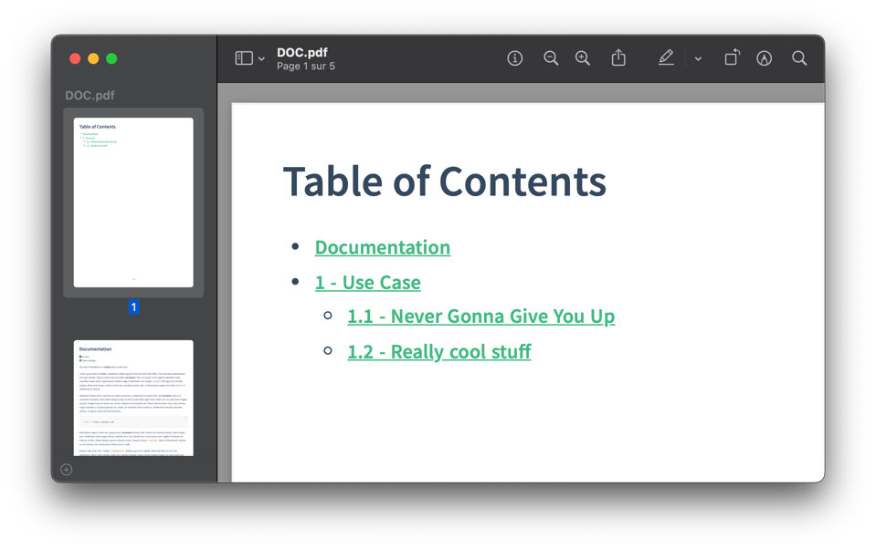
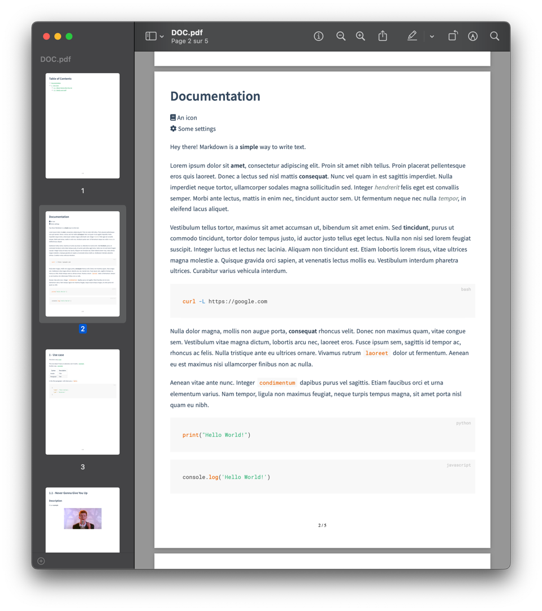
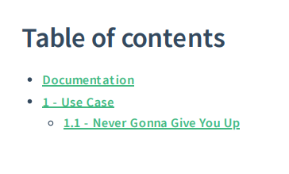

# Docker Docsify PDF generator


This project is based on [meff34/docsify-to-pdf-converter](https://github.com/meff34/docsify-to-pdf-converter/) repository.

A lot of fixes and improvements have been made :

- Fix : 
  - Slugify / internal **URL** (some URLs were not properly encoded)
  - `localhost` links are now disabled
  - **Codeblocks** (some code blocks were sliced)
  - Better margins in the final PDF
  - Page breaks between sections
- Security/performance : 
  - Update dependencies (Puppeteer, Docsify, ...)
- Feats :
  - **Table of content** (based on sidebar)
  - Custom **cover** PDF page
  - **Docker** way to generate PDF
  - Highlight code blocks (with PrismJS)
  - **Multilingual** support
- Chore : 
  - Migration to [pnpm](https://pnpm.io/) (no more npm)
  - Clean code with standard ESLint
  - Remove useless stuff


# Usage

First, create a documentation in a `docs` directory (you can follow the repository example).  
Create a `.docsifytopdfrc.js` file, with the following content :

```
module.exports = {
  contents: [ "docs/_sidebar.md" ], // array of "table of contents" files path,
  cover: "resources/cover.pdf", // pdf cover file path
}
```

* Tip : if you cloned the project, you can run `zx README.md` to generate the PDF directly from this Markdown if you have [zx](https://github.com/google/zx) installed.

**Pull the image** and create output directory :
```bash
# To build locally
# docker build -t docsify-pdf-generator .
docker pull ghcr.io/kernoeb/docker-docsify-pdf:latest

# To give the good permissions (no root!)
mkdir -p $(pwd)/pdf
```

**Run the container** (volumes are important) :
```bash
docker run --rm -it \
  --cap-add=SYS_ADMIN \
  --user $(id -u):$(id -g) \
  -v $(pwd)/docs:/home/node/docs:ro \
  -v $(pwd)/pdf:/home/node/pdf:rw \
  -v $(pwd)/resources/covers/cover.pdf:/home/node/resources/cover.pdf:ro \
  -e "PDF_OUTPUT_NAME=DOCUMENTATION.pdf" \
  ghcr.io/kernoeb/docker-docsify-pdf:latest
```

> To change `_sidebar.md` location (for example with multi-language support) :  
> Add `-v $(pwd)/docs/de/_sidebar.md:/home/node/docs/_sidebar.md:ro` to the command

> The PDF cover is optional (just don't add the mapping).  
> You can also customize the PDF css by adding a volume mapped to the `resources` directory.


# Screenshots






